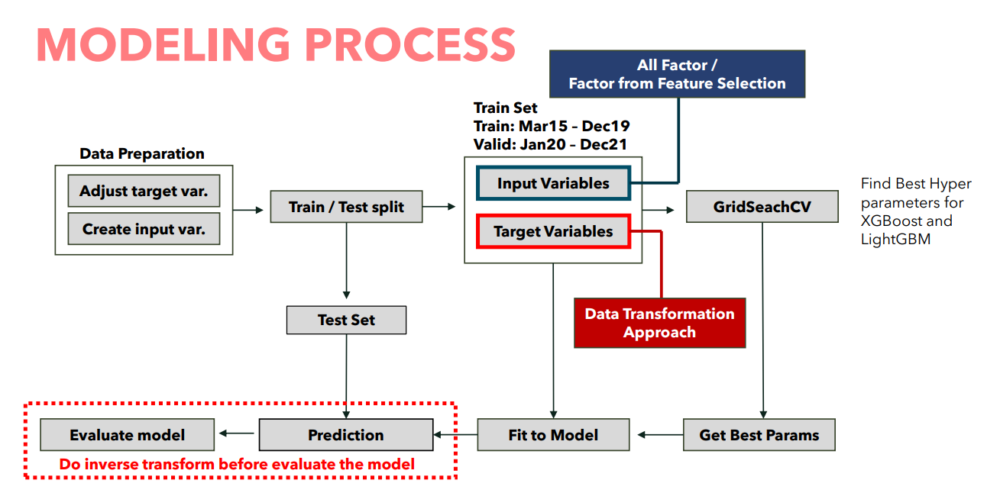

# Forecasting of Dengue Hemorrhagic Fever cases using machine learning

## Objective
To estimate number of Dengue Hemorrhagic Fever (DHF) patients in each month by using environment factors such as rain acccumualtion, humidity relative, temperature.

## Study Area
Ban Suan Hospital

## Data Source
1. Ban suan Hospital Records:
Monthly reports of DHF cases from January 2015 to December 2022 were collected from the hospital's database. These reports contained information on the number of DHF patients diagnosed each month.

2. Meteorological Data:
Monthly records of rain accumulation (measured in millimeters), relative humidity (expressed as a percentage), and temperature (highest, lowest, and average in Celsius) were sourced from the local meteorological department for the same period. The meteorological data were recorded at standardized measurement stations near Ban Suan Hospital.

## Data Preparation
1. Train / Test split
2. Adjust Data on Train set: Target Variable (Number of patients)
3. Create lag variables
4. Summarize data for input variable
5. Data Transformation on Target Variable (Number of patients)

## Methodology
1. Ensemble Learning : Boosting
2. XGBoost
3. LightGBM
4. Feature selection: Pearson correlation coefficient
5. Evaluation Metrics

## Modeling Process

## Result and Conclusion
1. Result on train set
   XGBoost with standardize transform and use all factor is the best model for train set.
2. Result on validate set
   Same with the train set, XGBoost with standardize transform and all factor is the best model for validate set.
3. Result on test set
   XGBost with normalize transform and use the factor from feature selection is the best model for test set if we focus on root mean squared error.
   But, if we focus on mean absolute error, the more that has lowest mean absolute error is XGBoost with log transform and use all factor.
   

    
